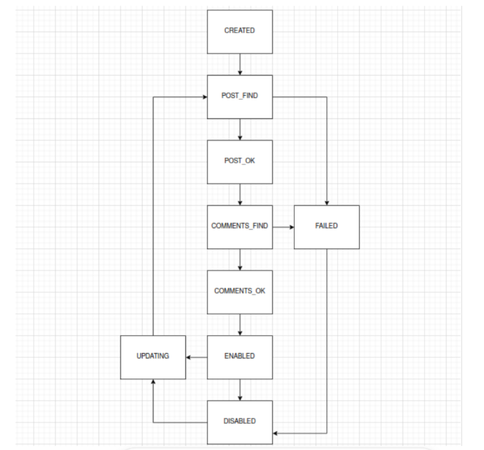

<h1 align="center">Post Harvester - Challenge 3</h1>

<p align="center">
    This is an application submitted to the 3rd challenge of Compass UOL internship program</br>
    The application has to fetch posts from the following API <a href="https://jsonplaceholder.typicode.com">https://jsonplaceholder.typicode.com</a> enrich them with comment data and creates a log of processing. The client will then be able to search for posts and the history os states through the API immediately.</br> 
</p>

<hr class="horizontal-line"/>

## ➤ Run the application locally

Git clone the project.<br/>
The recommended IDE to use is IntelliJ, but you can use others if you prefer. <br/>
The database used is H2 as specified, the username is <i>sa</i> and there is no password to simplify the utilization by the evaluators.<br/>
The data can be visualized entering the following URL on the browser <a>http://localhost:8080/h2-console </a><br/>
The JDBC URL to use inside the H2 user interface is ```jdbc:h2:mem:post-harvester```

<hr class="horizontal-line"/>

## ➤ Testing the application

In the resources folder of the project there is a ```post-harvester-postman.json``` file that can be used in the import feature of Postman.<br/>
Inside the file there is the endpoints that can be accessed inside Postman to verify the functionalities of the application.

<hr class="horizontal-line"/>

## ➤ Endpoints

<p>
    The application has swagger dependency to document the endpoints<br/>
    The documentation can be accessed at <a>http://localhost:8080/swagger-ui/index.html</a>
</p>
<p>Below are detailed the available endpoints on the application.</p>


| Parâmetro  | Tipo      | Descrição                                                                |
|:-----------|:----------|:-------------------------------------------------------------------------|
| `postId`   | `Integer` | **Mandatory**. Id of the post to be processed. Must be between 1 and 100 |

<p><b>POST</b> HTTP Request. It fetches the information of the specified post from the external API, stores it in the database and returns the post. But it only accepts posts that hasn't been created yet or posts in the UPDATING state.</p>

```http
http://localhost:8080/posts/{postId}
```

<p><b>DELETE</b> HTTP Request. Disables the specified post, but in order for the post to be processed it needs to be in the ENABLED state.</p>

```http
http://localhost:8080/posts/{postId}
```

<p><b>PUT</b> HTTP Request. Changes the state of the post to UPDATING, but it only accepts posts in the ENABLED or DISABLED state.</p>

```http
http://localhost:8080/posts/{postId}
```

<p><b>GET</b> By Id HTTP Request. It returns the specified post.</p>

```http
http://localhost:8080/posts/{postId}
```

<p><b>GET</b> HTTP Request. Returns all the posts in the database, but it applies pagination and sorting to better organize the data.</p>

```http
http://localhost:8080/posts
```

| Parameter    | Type      | Default | Description                                                                        |
|--------------|-----------|---------|------------------------------------------------------------------------------------|
| `pageNumber` | `Integer` | 0       | **Optional**. Chooses the number of the page                                       |
| `pageSize`   | `Integer` | 4       | **Optional**. Chooses the size of the page                                         |
| `sortBy`     | `String`  | id      | **Optional**. Defines by which parameter to sort the posts                         |
| `direction`  | `String`  | asc     | **Optional**. Defines the direction of the sorting. Either ascending or descending |

<hr class="horizontal-line"/>

## ➤ States of Posts

<p>
    The flow of states obey the diagram below, as specified in the challenge description.
</p>



<ul>
    <li>CREATED: Initial state of a new post;</li>
    <li>POST_FIND: Indicates that the app is searching for basic post data;</li>
    <li>POST_OK: Indicates that the basic post data is already available;</li>
    <li>COMMENTS_FIND: Indicates that the app is searching for post comments;</li>
    <li>COMMENTS_OK: Indicates that the post comments are already available;</li>
    <li>ENABLED: Indicates that the post has been successfully processed and is enabled;</li>
    <li>DISABLED: Indicates that the post is disabled, either due to a processing failure or by user decision;</li>
    <li>UPDATING: Indicates that the post needs to be reprocessed;</li>
    <li>FAILED: Indicates a processing error.</li>
</ul>

<style>
    .horizontal-line {
        background-color: #FFCE00;
    }

  .flow {
      margin: 0 auto;
      display: flex;
      flex-wrap: wrap;
      justify-content: center;
      align-items: center;
  }

</style>